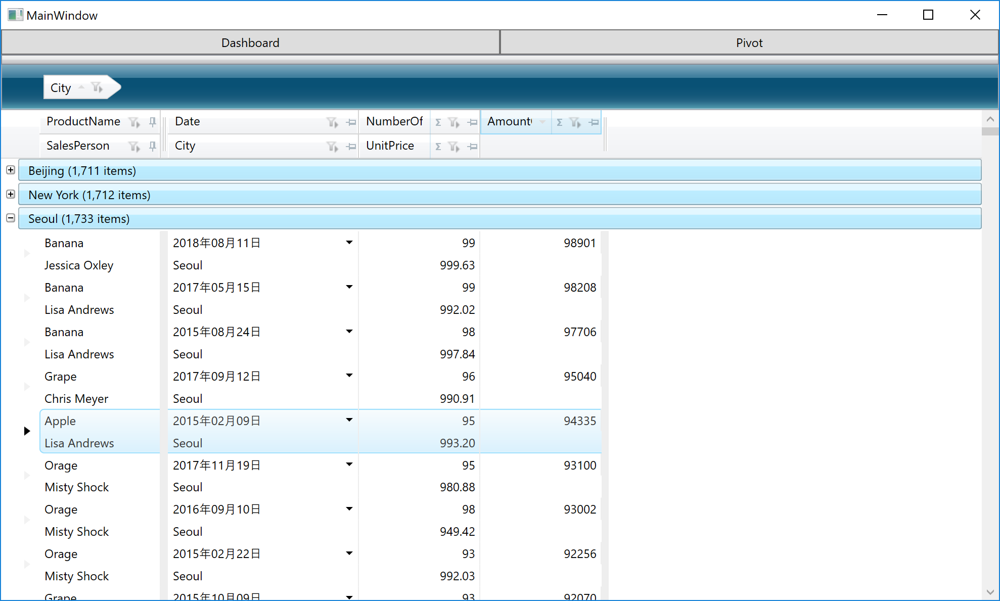

# Infragistics WPF 製品体験ハンズオン
## このハンズオンコンテンツについて

このハンズオンは、Infragistics の WPF 製品を利用してみたい、WPF 開発プロジェクトでグリッドやチャートなどUI部品を探している、そんな方向けに作成したコンテンツです。このハンズオンを通じてInfragisticsの各UI部品や Control Configulator を実際に利用し、ツール利用の生産性の高さを体験いただけます。

[英語版はこちら(English content)](https://github.com/gdayori/infragistics-wpf-workshop)

## 環境確認

ハンズオンを始める前に、以下の環境要件を確認してください。

[環境要件](docs/00-Environment.md)

## ハンズオンで使用するWPFアプリケーション

当リポジトリのコピーをダウンロードし、「infragistics-wpf-workshop-jp/src/before/IgWpfWorkshop」にあるWPFプロジェクトを起動してみてください。このプロジェクトがハンズオンを始める元となります。このプロジェクトは、ハンズオンに必要なModelやViewModel、データなどを全て含んでおり、ハンズオンの中ではViewに専念することができるようになっています。

なお、Afterフォルダの中には、このハンズオンコンテンツが全て完了した場合の想定プロジェクトが格納されています。時間が足りずに最後までできなかった場合は、Afterフォルダの中のプロジェクトでコードや結果を確認できます。

## 手順

1. [Section 1 - グリッド部品を利用した一覧の作成](docs/01-Use-Infragistics-Grid-control/01-00-Overview-of-Section1.md)
    1. [XamDataGrid の利用](docs/01-Use-Infragistics-Grid-control/01-01-Get-started-with-XamDataGrid.md)
    2. [XamDataGrid の設定](docs/01-Use-Infragistics-Grid-control/01-02-Configure-XamDataGrid.md)
2. [Section 2 - チャート部品とControl Configulatorを利用したダッシュボードの作成](docs/02-Create-dashboard-with-Control-Configulator/02-00-Overview-of-Section2.md)
    1. [Control Configulator のインストール](docs/02-Create-dashboard-with-Control-Configulator/02-01-Install-Control-Configulator.md)
    2. [XamTileManager を利用したダッシュボードのレイアウト作成](docs/02-Create-dashboard-with-Control-Configulator/02-02-Layout-screen-with-XamTileManager.md)
    3. [PieChart の利用](docs/02-Create-dashboard-with-Control-Configulator/02-03-Configure-PieChart.md)
    4. [BulletGraph の利用](docs/02-Create-dashboard-with-Control-Configulator/02-04-Configure-BulletGraph.md)
    5. [Grid の利用](docs/02-Create-dashboard-with-Control-Configulator/02-05-Configure-Grid.md)
    6. [CategoryChart の利用](docs/02-Create-dashboard-with-Control-Configulator/02-06-Configure-CategoryChart.md)
3. [Section 3 - ピボット部品を利用したセルフBI画面の作成](docs/03-Create-Self-BI-UI-with-Pivot-controls/03-00-Overview-of-Section3.md)
    1. [FlatDataSource の利用](docs/03-Create-Self-BI-UI-with-Pivot-controls/03-01-Use-FlatDataSource.md)
    2. [ピボット部品の利用](docs/03-Create-Self-BI-UI-with-Pivot-controls/03-02-Use-Pivot-Controls.md)

## ハンズオンで作成するWPFアプリケーションのイメージ
Section 1 - グリッド部品を利用した一覧の作成

Section 2 - チャート部品とControl Configulatorを利用したダッシュボードの作成

Section 3 - ピボット部品を利用したセルフBI画面の作成
