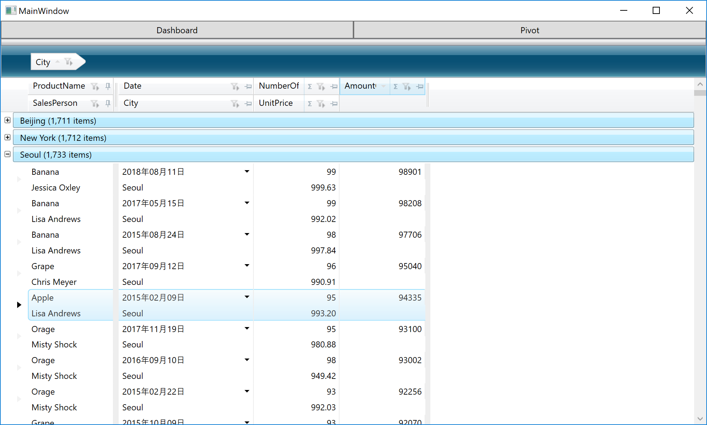

#  グリッド部品を利用した一覧の作成

このセクションでは、Infragistics WPF コントロールの利用方法をグリッド部品の XamDataGrid を通じて学習します。このコントロールを利用して、リッチな一覧のUIを素早く作成することができます。

## 手順
1. [XamDataGrid の利用](01-01-Get-started-with-XamDataGrid.md)
3. [XamDataGrid の設定](01-02-Configure-XamDataGrid.md)

## このセクションで作成する画面イメージ

## Next

[XamDataGridの利用](01-01-Get-started-with-XamDataGrid.md)