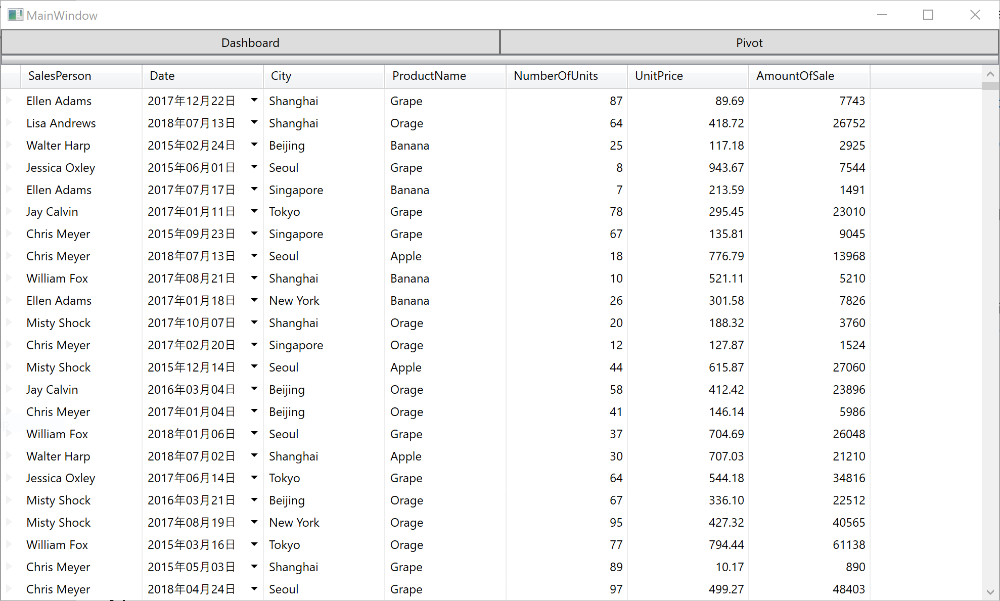

# XamDataGrid の利用

PC上にInfragistics WPF部品をインストールしていれば、収録されているすべてのコントロールがVisual Studio上のTool Boxに表示されます。利用方法はWPF標準コントロールと同じで、ドラッグ＆ドロップでコントロールをデザイナ上に配置できます。

ダウンロードしたZipファイルを解凍し、beforeフォルダの中のソリューションをVisual Studioで開きましょう。

## ViewModel の確認

MainWindowViewModel.cs を開いて提供されているデータを確認します。

```cs
...
public ICommand OpenDashboard { get; set; }
public ICommand OpenBiWindow { get; set; }

public MainWindowViewModel()
{

    //Get sales data to be bound to grid
    SalesDataSample salesDataSample = new SalesDataSample();
    salesRecords = salesDataSample.SalesData;

    // Commands
    OpenDashboard = new OpenDashboardCommand();
    OpenBiWindow = new OpenPivotCommand();
}

private ObservableCollection<Sale> salesRecords;
public ObservableCollection<Sale> SalesRecords
{
    get { return salesRecords; }
}
...
    
```

このクラスには以下が含まれます。
 - SalesRecords - XamDataGrid へバインドするデータ
 - OpenDashboardCommand - ダッシュボード画面を立ち上げるコマンド (section 2 で利用します。)
 - OpenPivotCommand - ピボット画面を立ち上げるコマンド (section 2 で利用します。)

## MainWindow.xaml の確認

MainWindow.xaml を開いて中身を確認します。
```xml
<Window
        xmlns="http://schemas.microsoft.com/winfx/2006/xaml/presentation"
        xmlns:x="http://schemas.microsoft.com/winfx/2006/xaml"
        xmlns:d="http://schemas.microsoft.com/expression/blend/2008"
        xmlns:mc="http://schemas.openxmlformats.org/markup-compatibility/2006"
        xmlns:local="clr-namespace:IgWpfWorkshop"
        xmlns:vm="clr-namespace:IgWpfWorkshop.ViewModel" xmlns:Custom="http://infragistics.com/DataPresenter" x:Class="IgWpfWorkshop.MainWindow"
        mc:Ignorable="d"
        Title="MainWindow" Height="600" Width="1000"
        >
    <Window.DataContext>
        <vm:MainWindowViewModel/>
    </Window.DataContext>
    <Grid>
        <Grid.ColumnDefinitions>
            <ColumnDefinition Width="*"/>
            <ColumnDefinition Width="*"/>
        </Grid.ColumnDefinitions>
        <Grid.RowDefinitions>
            <RowDefinition Height="25px"/>
            <RowDefinition Height="*"/>
        </Grid.RowDefinitions>

        <Button Content="Dashboard" Command="{Binding OpenDashboard}" Grid.Column="0"/>
        <Button Content="Pivot" Command="{Binding OpenBiWindow}" Grid.Column="1"/>
    </Grid>
</Window>
```

このXAMLには以下が含まれます。
 - このViewにバインドされているMainWindowViewModel
 - スクリーンの分割とレイアウトのための Gird 設定
 - ダッシュボード画面とピボット画面立ち上げようのボタン

## XamDataGrid の追加

MainWindow.xaml を開いている状態で、ツールボックスからXamDataGridをドラッグ＆ドロップでデザイナ上に配置します。 更に、XamDataGridのレイアウトをリセットし、DataSourceプロパティにSalesRecordsをバインドします。

MainWindow.xaml

```xml
・・・
<Custom:XamDataGrid DataSource="{Binding Path=SalesRecords}" Grid.Row="1" Grid.ColumnSpan="2"/>
・・・
```

## 結果確認

アプリケーションを実行し、結果を確認します。



## 備考

XamDataGrid にはバインドデータのプロパティに応じて自動的に列設定を生成する仕組みがあります。自分で列定義を細かく設定していくこともできますが、この例では自動生成の仕組みを使ってグリッド表示しています。

## Next
[01-02 XamDataGridの設定](01-02-Configure-XamDataGrid.md)
