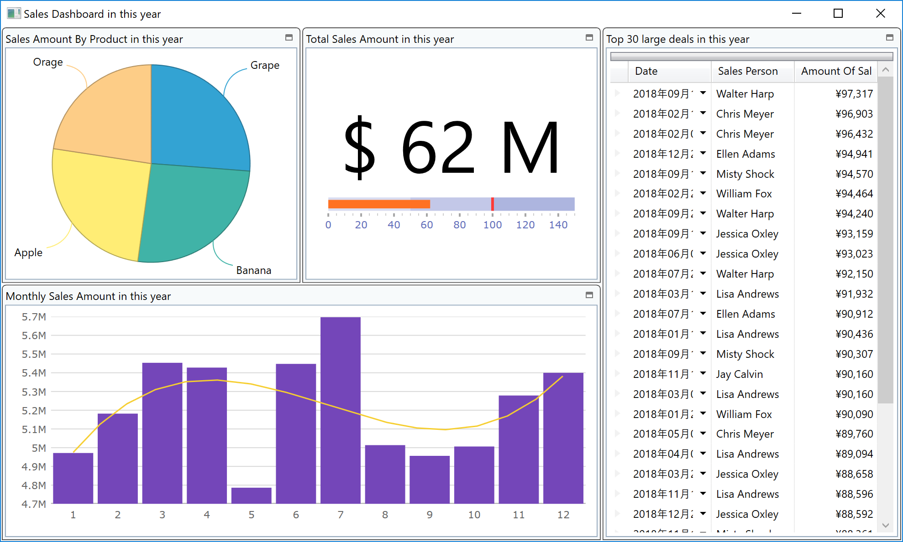

# チャート部品とControl Configulatorを利用したダッシュボードの作成

このセクションではチャート部品と Control Configulator を利用してリッチなダッシュボードを作成します。

## 手順
1. [Control Configulator のインストール](02-01-Install-Control-Configulator.md)
2. [XamTileManager を利用したダッシュボードのレイアウト作成](02-02-Layout-screen-with-XamTileManager.md)
3. [PieChartの利用](02-03-Configure-PieChart.md)
4. [BulletGraph の利用](02-04-Configure-BulletGraph.md)
5. [Grid の利用](02-05-Configure-Grid.md)
6. [CategoryChart の利用](02-06-Configure-CategoryChart.md)

## このセクションで作成する画面イメージ

## Next
[02-01 Control Configulator のインストール](02-01-Install-Control-Configulator.md)