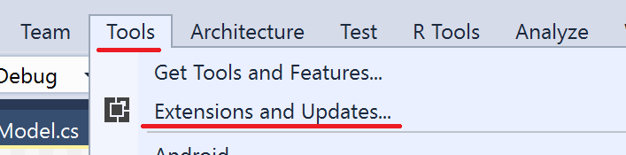
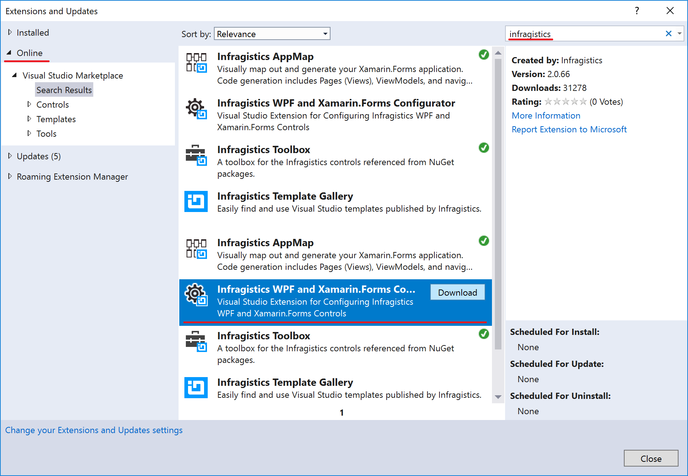
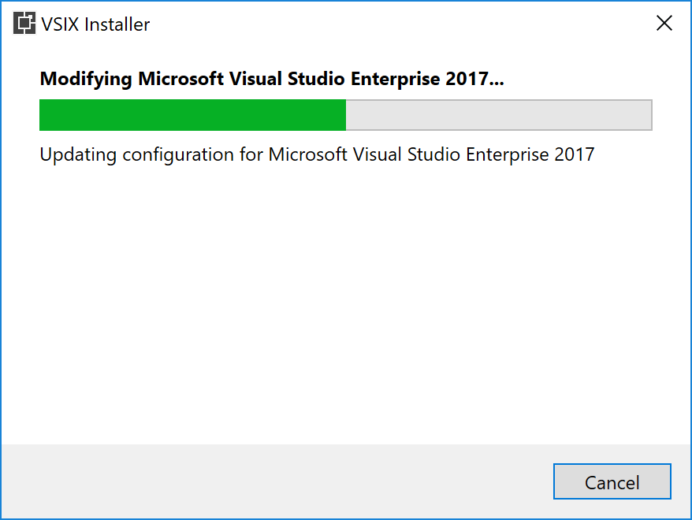
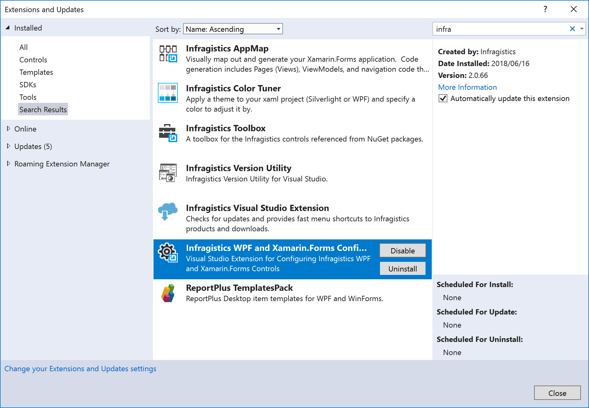

# Control Configulator のインストール

Visual Studio 上で Control Configulator をインストールします。

## Control Configulator のインストール

Visual Studio のメニューより「ツール」→「拡張機能と更新プログラム」を開き、オンラインで"infragistics"を検索すると、「Infragistics WPF and Xamarin.Forms Configulator」が見つかります。

「Infragistics WPF and Xamarin.Forms Configulator」をダウンロードして、Visual Studioを閉じるとツール自体のインストールが始まります。

インストールが終わったら再度Visual Studioを開いて、ツールがインストールされている事を確認します。

## 備考

[Infragistics Control Configurator ヘルプ](https://jp.infragistics.com/help/wpf/getting-started-with-control-configurators)

## Next
[02-02 XamTileManagerを利用したダッシュボードのレイアウト作成](02-02-Layout-screen-with-XamTileManager.md)
