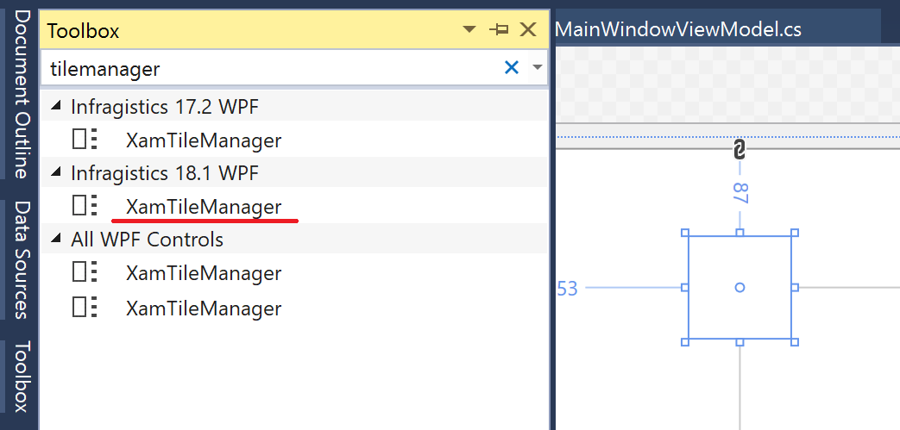
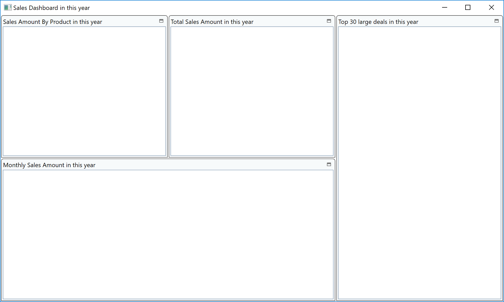

# XamTileManager を利用したダッシュボードのレイアウト作成

XamTileManager はタイル形式のUIで画面レイアウトを構成します。ユーザがタイルの配置やサイズを変更することができるダッシュボードを簡単に作成する事ができます。

## XamTileManager の配置

Dashboard.xaml を開いてツールボックスから XamTileManager をデザイナ上へ配置します。



XamTileManager 内で、ダッシュボードのウィジェットとしてタイルをいくつか配置し、以下のように設定します。コード量が多いため、コピー＆ペーストでOKです。

Dashboard.xaml

```xml
...
<Grid>
    <ig:XamTileManager>
        <ig:XamTileManager.NormalModeSettings>
            <ig:NormalModeSettings TileLayoutOrder="UseExplicitRowColumnOnTile"
                                    VerticalTileAreaAlignment="Stretch"
                                    HorizontalTileAreaAlignment="Stretch">
                <ig:NormalModeSettings.TileConstraints>
                    <ig:TileConstraints PreferredWidth="400" PreferredHeight="300"/>
                </ig:NormalModeSettings.TileConstraints>
            </ig:NormalModeSettings>
        </ig:XamTileManager.NormalModeSettings>

        <ig:XamTile
            Header="年間製品別売上比率"
            ig:XamTileManager.Column="0"
            ig:XamTileManager.Row="0" 
            ig:XamTileManager.ColumnSpan="1"
            ig:XamTileManager.RowSpan="1">
        </ig:XamTile>

        <ig:XamTile
            Header="年間売り上げ"
            ig:XamTileManager.Column="1"
            ig:XamTileManager.Row="0" 
            ig:XamTileManager.ColumnSpan="1"
            ig:XamTileManager.RowSpan="1">
        </ig:XamTile>

        <ig:XamTile
            Header="取引上位30"
            ig:XamTileManager.Column="2"
            ig:XamTileManager.Row="0" 
            ig:XamTileManager.ColumnSpan="1"
            ig:XamTileManager.RowSpan="2">
        </ig:XamTile>

        <ig:XamTile
            Header="月別売り上げ"
            ig:XamTileManager.Column="0"
            ig:XamTileManager.Row="1" 
            ig:XamTileManager.ColumnSpan="2"
            ig:XamTileManager.RowSpan="1" >
        </ig:XamTile>
    </ig:XamTileManager>
</Grid>
...
```

XamTileManager 内で4つのタイルを構成します。
 - 年間製品別売上比率
 - 年間売り上げ
 - 取引上位30
 - 月別売り上げ

## 結果確認

アプリケーションを実行し、結果を確認します。タイルのヘッダー部をドラッグ＆ドロップするか、ヘッダー部のタイルアイコンをクリックすることで、タイルを入れ替えたり拡大したりすることができます。



## 備考
XamTileManager についてより詳しい情報は以下のヘルプトピックより確認いただけます。

[Using xamTileManager](https://jp.infragistics.com/help/wpf/xamtilemanager-using-xamtilemanager)

少し似たレイアウト系のUI部品として、XamDockManagerという部品も提供されています。Visuao Studioのドッキングペインのように、ペインをフローティングさせたりドッキングさせてタブ切り替えしたいすることがでいます。

[Using xamDockManager](https://jp.infragistics.com/help/wpf/xamdockmanager-using-xamdockmanager)


## Next
[02-03 PieChartの利用](02-03-Configure-PieChart.md)
