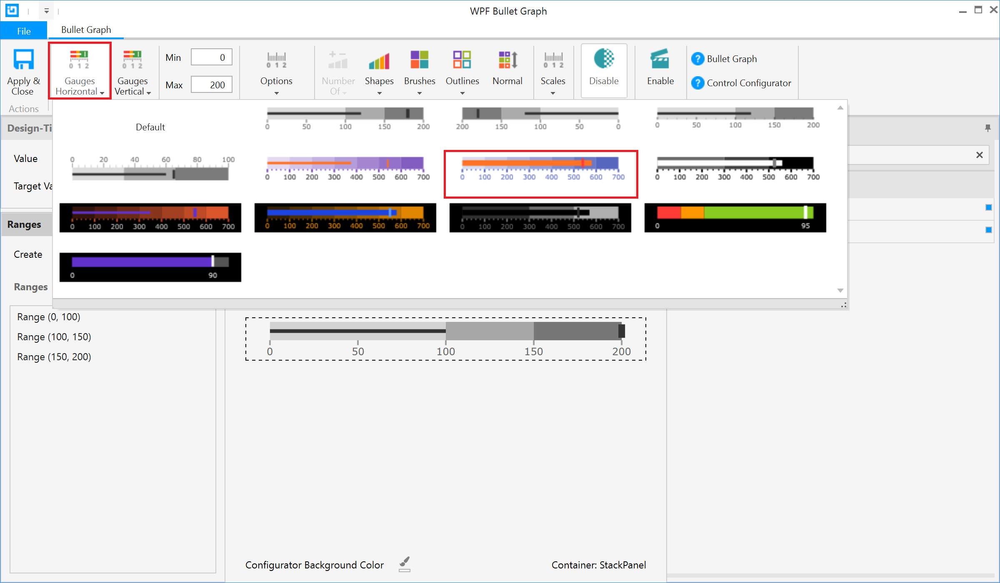
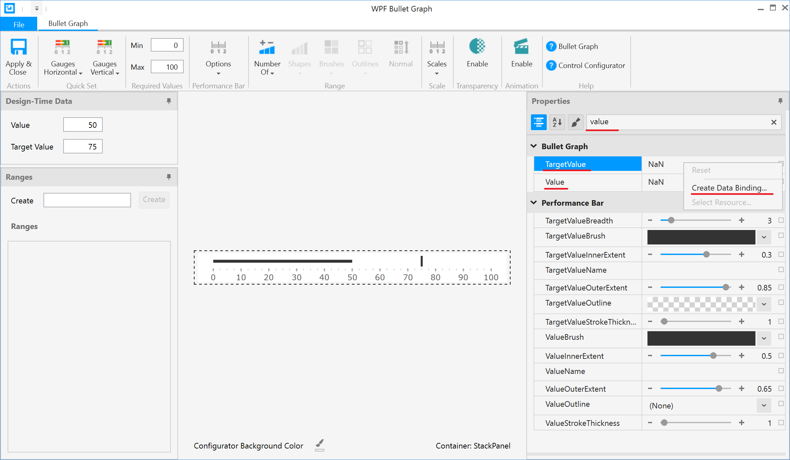
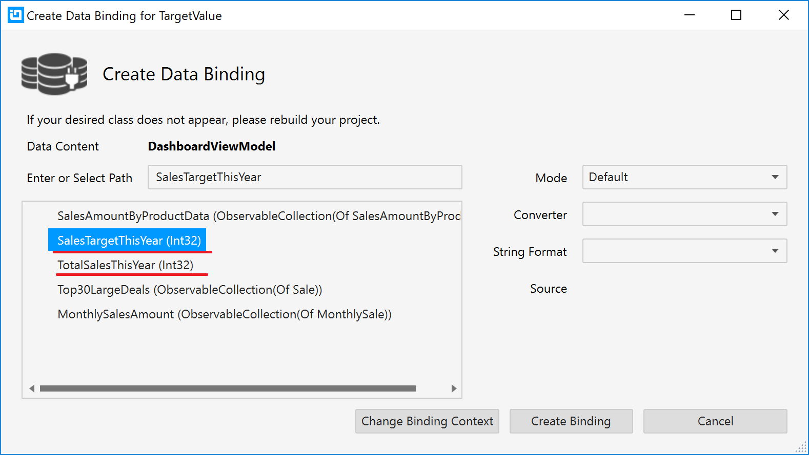
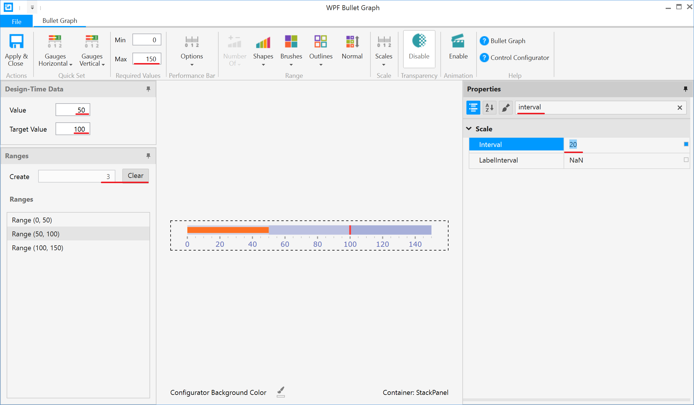
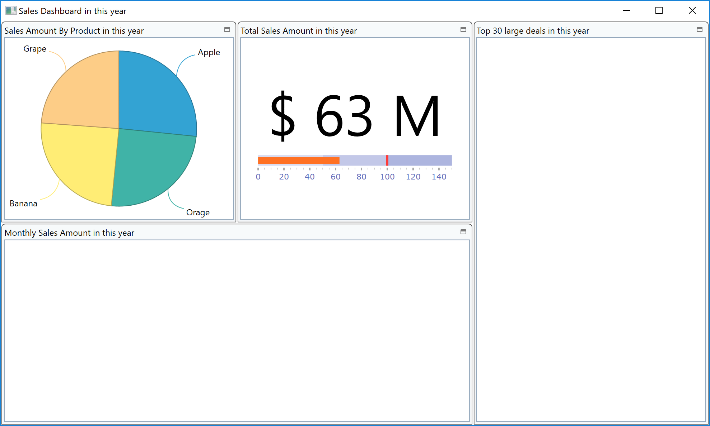

# BulletGraph の利用

ここでは、売上合計・目標を表示するためのグラフをXamBulletGraphを使って表現します。

## XamBulletGraph へバインドするデータソースの確認

DashboardViewModel.cs を開いて、ブレークポイントを設定してから実行し、TotalSalesThisYear と SalesTargetThisYear の中にどんなデータが入っているのか見てみましょう。

## XamBulletGraph の配置

Dashboard.xaml を開き、年間売り上げのタイル内に StackPanel を配置し、更にその中に XamBulletGraph と TextBlock を配置しそれぞれレイアウトをリセットします。

Dashboard.xaml

```xml
...
<ig:XamTile
    Header="年間売り上げ"
    ig:XamTileManager.Column="1"
    ig:XamTileManager.Row="0" 
    ig:XamTileManager.ColumnSpan="1"
    ig:XamTileManager.RowSpan="1">
    <StackPanel VerticalAlignment="Center" >
        <TextBlock/>
        <ig:XamBulletGraph/>
    </StackPanel>
</ig:XamTile>
...
```

## Control Configulator で XamBulletGraph を設定

XamBulletGraphが定義されている行をクリックすると、左側に豆電球アイコンが表示されます。その豆電球をクリックするか、Ctrl + .キーを押して"構成 XamBulletGraph"メニューをさらに選択します。Control configulator ダイアログが表示されたら、まず水平ゲージの設定を以下のように変更します。 



続いてプロパティウィンドウ上の検索BOX内で"value"と入力し、プロパティをフィルタします。



TargetValue プロパティへ SalesTargetThisYear を、Value プロパティへ TotalSalesThisYear をそれぞれ設定します。




最小値、最大値、デザインタイムデータの値や目標値を以下のように設定します。
範囲タブ上では、一度「クリア」ボタンで値をクリアしてから、入力領域に3を設定して「作成」ボタンをクリックします。すると、最大値をベースに自動的に3つのレンジを自動的に計算・生成してくれます。
また、プロパティウィンドウより Interval プロパティを探し、20を設定します。



最後に「適用して閉じる」ボタンをクリックして設定を終了します。

## TextBlock へ TotalSales を設定.

TextBlockのTextプロパティへTotalSalesThisYearをバインドします。以下のようにコードを記述してください。

Dashboard.xaml

```xml
...
<TextBlock HorizontalAlignment="Center" TextWrapping="Wrap" FontSize="80" Text="{Binding Path=TotalSalesThisYear, StringFormat= $ {0} M }"/>
</ig:XamBulletGraph ...>
...
```

## 結果確認

アプリケーションを実行し、結果を確認します。



## 備考
XamBulletGraphについて、より詳細を知りたい方は以下のリンクよりヘルプトピックをご確認下さい。

[Bullet Graph ヘルプ](https://jp.infragistics.com/help/wpf/bulletgraph-adding)

## Next
[02-05 Grid の利用](02-05-Configure-Grid.md)
