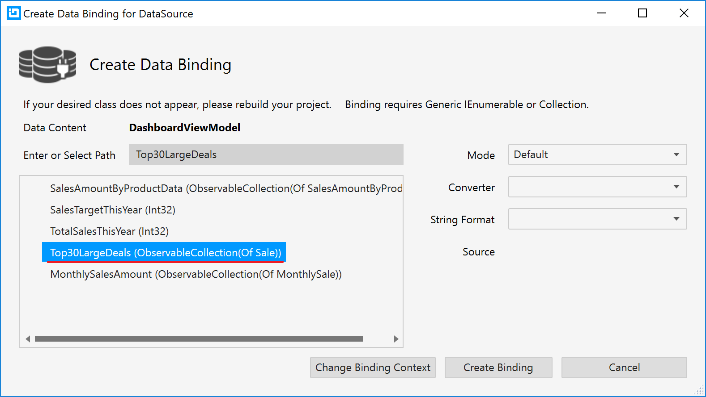

# Grid の利用

グリッドを追加し、売り上げの大きかった上位30件のレコードを一覧表示します。

## XamDataGrid へバインドするデータソースの確認

DashboardViewModel.cs を開いて、ブレークポイントを設定してから実行し、Top30LargeDeals の中にどんなデータが入っているのか見てみましょう。
以下のようなスキーマのデータが格納されています。

| AmountOfSale | City | Date | NumberOfUnits | ProductName | SalesPerson | UnitPrice |
----|----|----|----|----|----|----
123 | 東京 | 2018/01/01 | 123 | みかん | 山口 さとる | 123
456 | 北京 | 2018/02/02 | 456 | ぶどう | 池原 だいぜん | 456
... | ... | ... | ... | ... | ... | ...

なお、Top30LargeDeals にはすでにAmountOfSaleで降順ソートされた上位30件のレコードが格納されているため、特にソートなど行う必要はありません。

## XamDataGrid の配置

Dashboard.xaml を開き、取引上位30のタイル内に XamDataGrid を配置し、それぞれレイアウトをリセットします。

Dashboard.xaml

```xml
...
<ig:XamTile
    Header="取引上位30"
    ig:XamTileManager.Column="2"
    ig:XamTileManager.Row="0" 
    ig:XamTileManager.ColumnSpan="1"
    ig:XamTileManager.RowSpan="2">
    <Custom:XamDataGrid/>
</ig:XamTile>
...
```

## Control Configulator で XamDataGrid を設定

XamDataGridが定義されている行をクリックすると、左側に豆電球アイコンが表示されます。その豆電球をクリックするか、Ctrl + .キーを押して"構成 XamBulletGraph"メニューをさらに選択します。Control Configulator のダイアログ上のプロパティウィンドウ上でDataSourceプロパティを見つけて、"データバインドの作成"を選択します。


Top30LargeDeals を選択し、"バインディングの作成"をクリックします。



XamDataGridオブジェクト タブの中で、"Sale レイアウト"を選択し、フィールド タブの中で追加したい列を"+"より追加します。


AmountOfSale が列に含まれている場合は、フィールドタイプを「通貨」に設定することで、カンマ区切りなど自動的にフォーマットすることができます。


なお、フォーマットについては、formatプロパティを設定することで変更することも可能です。


このケースではグリッドは横幅が可変のタイル内に配置されています。グリッド自体の幅変更に応じて全ての列幅を自動的に伸縮させたい場合は、FieldLayoutsのautoFitプロパティをTrueに設定します。


XamDataGrid のその他の設定を任意で行い、最後に「適用して閉じる」ボタンをクリックして設定を終了します。


## 結果確認

アプリケーションを実行し、結果を確認します。


## 備考
Control Configuratorを利用したXamDataGridの設定について、より詳細を知りたい方は以下のリンクよりヘルプトピックをご確認下さい。

[Control ConfiguratorでXamDataGridを設定](https://jp.infragistics.com/help/wpf/using-control-configurator-with-data-grid)

## Next
[02-06 CategoryChart の利用](02-06-Configure-CategoryChart.md)
