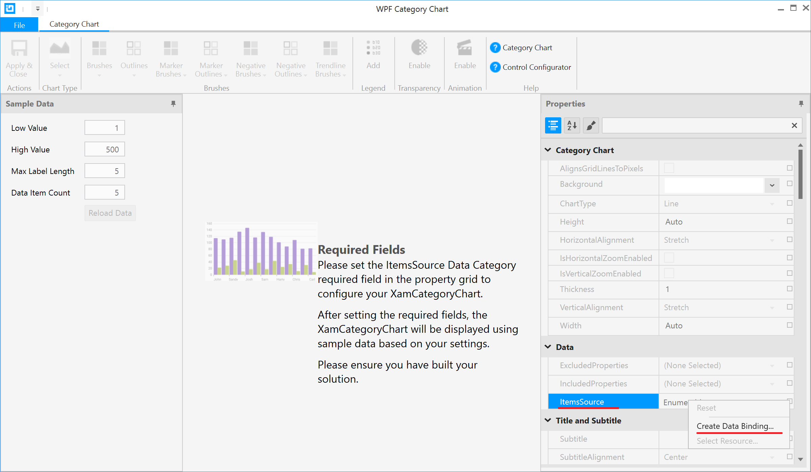
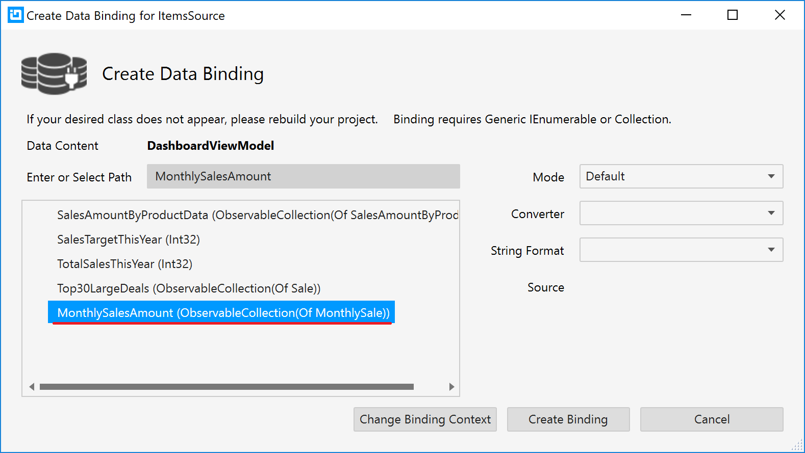
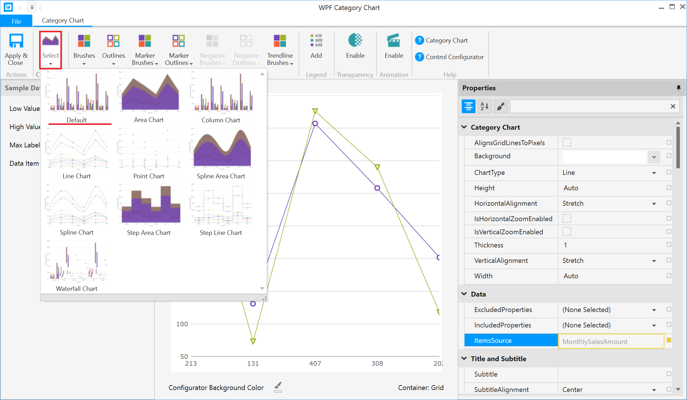
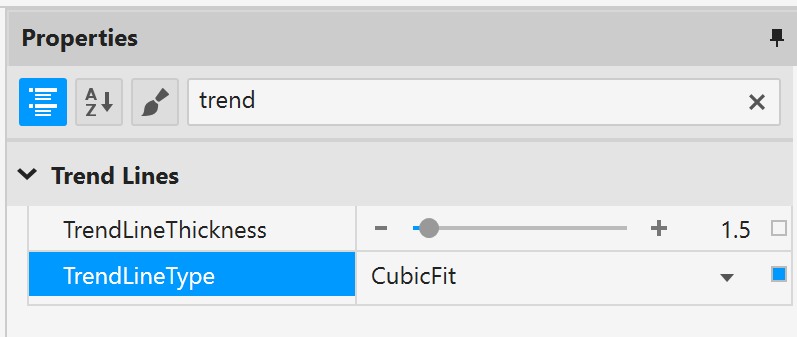
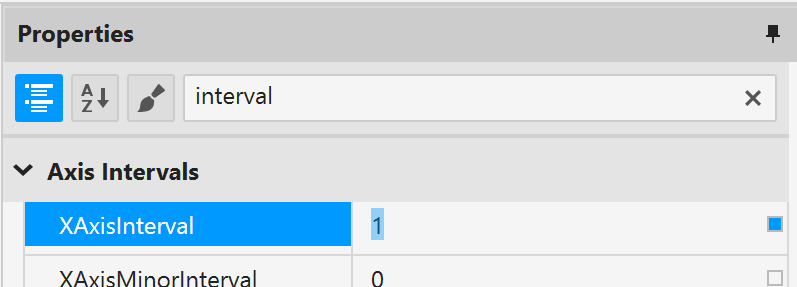
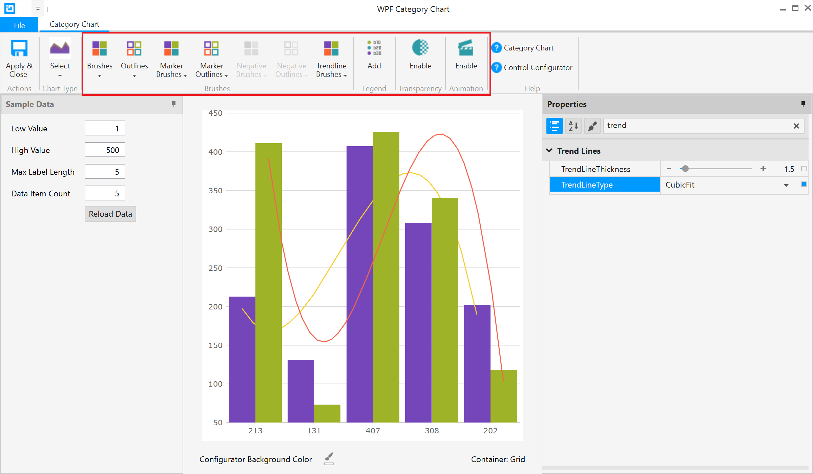
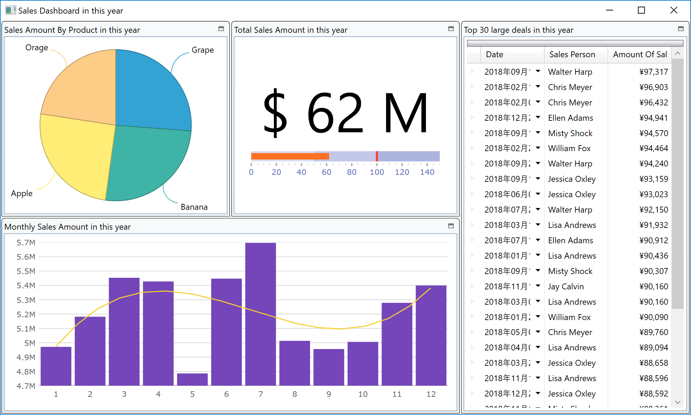

# CategoryChart の利用

月毎の売り上げ推移を表現するためにXamCategoryChartを利用します。

## XamPieChart へバインドするデータソースの確認

DashboardViewModel.cs を開いて、ブレークポイントを設定してから実行し、MonthlySalesAmount の中にどんなデータが入っているのか見てみましょう。

| Month | AmountOfSale |
----|---- 
| 1 | 123 |
| 2 | 456 |
| ... | ... |


## XamCategoryChart の配置

Dashboard.xaml を開き、月別売り上げのタイル内にXamPieChart を配置し、レイアウトをリセットします。

Dashboard.xaml

```xml
...
<ig:XamTile
    Header="月別売り上げ"
    ig:XamTileManager.Column="0"
    ig:XamTileManager.Row="1" 
    ig:XamTileManager.ColumnSpan="2"
    ig:XamTileManager.RowSpan="1" >
    <ig:XamCategoryChart />
</ig:XamTile>
...
```

## Control Configulator で XamCategoryChart を設定

XamCategoryChartが定義されている行をクリックすると、左側に豆電球アイコンが表示されます。その豆電球をクリックするか、Ctrl + .キーを押して"構成 XamBulletGraph"メニューをさらに選択します。Control Configulator のダイアログ上のプロパティウィンドウ上でItemsSourceプロパティを見つけて、"データバインドの作成"を選択します。



MonthlySalesAmount を選択し、"バインディングの作成"をクリックします。



チャートタイプよりデフォルトのカラムチャートを選択します。



トレンドラインを表示するために、TrendLineTypeプロパティでCubicFitを選択します。



XAxisInterval プロパティに1を設定し、すべての月がラベル表示されるようにします。



XamCategoryChart のその他の設定を任意で行い、最後に「適用して閉じる」ボタンをクリックして設定を終了します。



**[注意] Control Configulator を立ち上げようとした際にエラーが発生し、プロジェクトのリビルドやVisual Studioの再起動で解決できない場合、代わりに、以下のコードを貼り付けてXamCategoryChartを設定して下さい。**

```xml
...
<ig:XamCategoryChart ChartType="Auto" ItemsSource="{Binding Path=MonthlySalesAmount}" TrendLineType="CubicFit" XAxisInterval="1" Brushes="#FF7446B9 #FF9FB328 #FFF96232 #FF2E9CA6 #FFDC3F76 #FFFF9800 #FF3F51B5 #FF439C47 #FF795548 #FF9A9A9A" Outlines="#FF7446B9 #FF9FB328 #FFF96232 #FF2E9CA6 #FFDC3F76 #FFFF9800 #FF3F51B5 #FF439C47 #FF795548 #FF9A9A9A" MarkerBrushes="#FFFFFFFF" MarkerOutlines="#FF7446B9 #FF9FB328 #FFF96232 #FF2E9CA6 #FFDC3F76 #FFFF9800 #FF3F51B5 #FF439C47 #FF795548 #FF9A9A9A" TrendLineBrushes="#FFF6CE2F #FFF3654D #FF00C6AC #FF38A8E1 #FFB16FC0 #FFE63C53 #FF8AD662 #FF6F72C0" NegativeBrushes="#FFC62828" NegativeOutlines="#FFC62828"  />
...
```

## 結果確認

アプリケーションを実行し、結果を確認します。



## 備考

XamCategoryChartは少ないコードで簡単にデータ視覚化を実現するための部品として提供されています。複数レイヤの表示や細かい軸の設定など、複雑なチャート表現を実現するためにはXamDataChartという別のチャートコントロールが提供されています。

[XamCategoryChart ヘルプ](https://jp.infragistics.com/help/wpf/categorychart-walkthrough)

[XamDataChart ヘルプ](https://jp.infragistics.com/help/wpf/datachart-getting-started-with-datachart)

## Next
[ピボット部品を利用したセルフBI画面の作成](../03-Create-Self-BI-UI-with-Pivot-controls/03-00-Overview-of-Section3.md)
