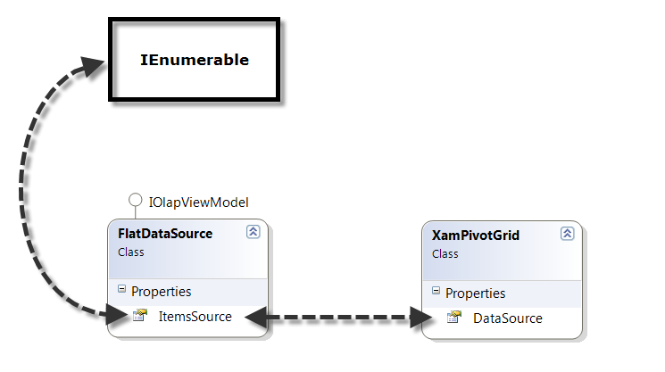

# FlatDataSource の利用

SQL Analytics Server や Oracle Essbase などデータ分析用のOLAPサーバーがプロジェクトで用意されている場合は、ピボット部品から分析のリクエストをサーバへ送信したり、分析結果をUI上に表現することができます。OLAPサーバーがない場合は、WPFアプリケーションが動作するクライアントのメモリ上で分析を行うためのFlatDataSourceを利用することができます。
FlatDataSourceを利用することで、クライアントのメモリ上で自由にデータのスライスやドリルダウンなど分析を行わせることができます。



## ViewModelの確認

PivotViewModel.cs を開いて提供されているデータを確認します。

```cs
...
    class PivotViewModel
    {
        public event PropertyChangedEventHandler PropertyChanged;

        public PivotViewModel()
        {
            //Get all data required in the pivot controls
            SalesDataSample salesDataSample = new SalesDataSample();
            var flatDataSource = new Infragistics.Olap.FlatData.FlatDataSource();
            flatDataSource.ItemsSource = salesDataSample.SalesData;
            salesFlatDataSource = flatDataSource;
        }

        //Flat DataSource to be bound to pivot controls
        private FlatDataSource salesFlatDataSource;
        public FlatDataSource SalesFlatDataSource
        {
            get { return salesFlatDataSource; }
        }
    }
...
```

このクラスでは、以下が含まれます。
 - SalesFlatDataSource - 各ピボット部品へデータバインドします

FlatDataSourceへバインドしている元データ（SalesData）は、セクション１で一覧表示したセールスデータと同様のものです。※特にコードを書く必要はなく、データの確認のみとなります。

## 備考

[ヘルプトピック FlatDataSource](https://jp.infragistics.com/help/wpf/xampivotgrid-databinding-using-flatdatasource)

[ヘルプトピック その他のデータソース](https://jp.infragistics.com/help/wpf/xampivotgrid-binding-data-to-the-xampivotgrid)

## Next
[03-02 ピボット部品の利用](03-02-Use-Pivot-Controls.md)
