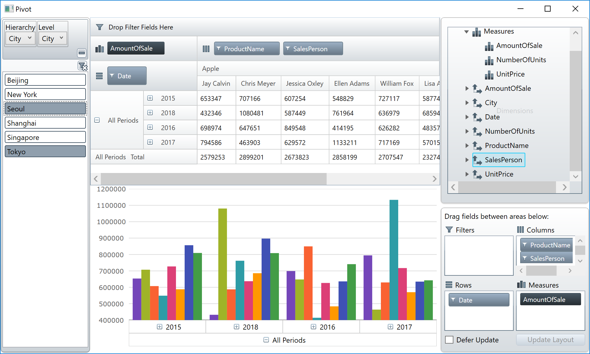

# ピボット部品の利用

Infragistics WPFにはピボット分析のUIコントロールとして、XamPivotGrid、XamPivotDataSelector、XamPivotDataSlicerが提供されています。

## Pivot.xaml の確認

Pivot.xaml を開いて中身を確認します。

Pivot.xaml

```xml
<Window x:Class="IgWpfWorkshop.Pivot"
        xmlns="http://schemas.microsoft.com/winfx/2006/xaml/presentation"
        xmlns:x="http://schemas.microsoft.com/winfx/2006/xaml"
        xmlns:d="http://schemas.microsoft.com/expression/blend/2008"
        xmlns:mc="http://schemas.openxmlformats.org/markup-compatibility/2006"
        xmlns:local="clr-namespace:IgWpfWorkshop"
        mc:Ignorable="d"
        Title="Pivot" Height="600" Width="1000"
        xmlns:vm="clr-namespace:IgWpfWorkshop.ViewModel">
    <Window.DataContext>
        <vm:PivotViewModel/>
    </Window.DataContext>
    <Grid>
        <Grid.RowDefinitions>
            <RowDefinition Height="*"/>
            <RowDefinition Height="*"/>
        </Grid.RowDefinitions>
        <Grid.ColumnDefinitions>
            <ColumnDefinition Width="150"/>
            <ColumnDefinition Width="*"/>
            <ColumnDefinition Width="250"/>
        </Grid.ColumnDefinitions>
        
    </Grid>
</Window>

```

このXAMLには以下が含まれます。
 - このViewにバインドされているPivotViewModel
 - スクリーンの分割とレイアウトのための Gird 設定

## ピボット部品とチャートの配置

Pivot.xaml を開いて以下の部品をデザイナ上に配置します。
 - XamPivotGird
 - XamPivotDataSelector
 - XamPivotDataSlicer
 - XamDataChart

## コントロールのレイアウト

配置した各コントロールのレイアウト設定(Grid設定)を以下のように行います。
```xml
...
<ig:XamPivotGrid Grid.Column="1" Grid.RowSpan="1" />
<ig:XamPivotDataSelector Grid.Column="2" Grid.RowSpan="2" />
<ig:XamPivotDataSlicer Grid.Column="0" Grid.RowSpan="2" />
<ig:XamDataChart Grid.Column="1" Grid.Row="1" />
...
```

## XamPivotGrid の設定

SalesFlatDataSource を XamPivtGrid へデータバインドします。

```xml
...
<ig:XamPivotGrid Grid.Column="1" Grid.RowSpan="1" DataSource="{Binding Path=SalesFlatDataSource}" />
...
```

## XamPivotDataSelector の設定

SalesFlatDataSource を XamPivotDataSelector へデータバインドします。

```xml
...
<ig:XamPivotDataSelector Grid.Column="2" Grid.RowSpan="2" DataSource="{Binding Path=SalesFlatDataSource}" />
...
```

## XamPivotDataSlicer の設定

SalesFlatDataSource を XamPivotDataSlicer へデータバインドします。※データソースを設定するプロパティ名は"SlicerProvider"です。

```xml
...
<ig:XamPivotDataSlicer Grid.Column="0" Grid.RowSpan="2" SlicerProvider="{Binding Path=SalesFlatDataSource}"/>
...
```

## XamDataChart の設定

SalesFlatDataSource を XamDataChart へデータバインドし、チャート軸(OlapXAxis)の設定を以下の通りに行います。

```xml
...
<ig:XamDataChart Grid.Column="1" Grid.Row="1" >
    <ig:XamDataChart.Axes>
        <ig:NumericYAxis Name="YAxis"></ig:NumericYAxis>
        <ig:OlapXAxis DataSource="{Binding Path=SalesFlatDataSource}" YAxis="{Binding ElementName=YAxis}" OlapAxisSource="Rows"></ig:OlapXAxis>
    </ig:XamDataChart.Axes>
</ig:XamDataChart>
...
```

## 結果確認

アプリケーションを実行し、結果を確認します。



## Note

[xamPivotGrid ヘルプ](https://jp.infragistics.com/help/wpf/xampivotgrid-using-xampivotgrid)
